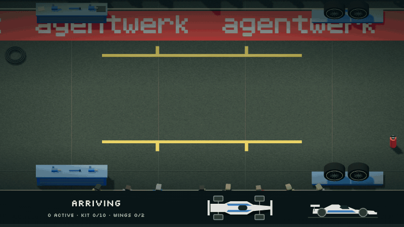

<div align="center">
  
</div>

<h1 align="center">agentwerk</h1>

<div align="center">
  <strong>A minimal agentic loop for building efficient harnesses.</strong>
</div>
<div align="center"><em>“Werk” is German for both a factory and a work of art.</em></div>

<div align="center">
  <a href="#installation">Installation</a> •
  <a href="crates/agentwerk-py/README.md">Python</a> •
  <a href="#api">API</a> •
  <a href="DEVELOPMENT.md">Development</a> •
  <a href="SECURITY.md">Security</a>
</div>

<br />

<div align="center">
  <a href="#lets-build-a-coding-harness">Coding Harness</a> •
  <a href="#lets-build-a-research-harness">Research Harness</a> •
  <a href="#lets-build-a-pit-stop-harness">Pit Stop Harness</a>
</div>

<div align="center"><strong>Beta:</strong> The API might introduce breaking changes before <code>0.2.0</code>.</div>

---

<div align="center">
  
</div>
<div align="center"><a href="crates/agentwerk-py/examples/pit_stop/main.py">Watch 19 agents coordinate a pit stop in real time.</a></div>
<div align="center">Coordinate agent fleets across complex tasks, with detailed observability and shared knowledge.</div>

---

## Installation

```bash
cargo add agentwerk
```

[Python bindings](crates/agentwerk-py/README.md)

---

## Let's Build a Coding Harness

Use a [planner and coder](crates/use-cases/src/coding_harness/main.rs) to change a repository. Both agents inspect the repository, but only the coder edits files and runs Rust checks. Define the command tools first.

<details>
<summary><code>planner.md</code></summary>

```markdown
# Planner

You inspect a repository and turn one requested change into a grounded implementation
plan for the coder. You return the files, steps, and checks the coder needs
without modifying the repository.

Your strengths:
- Finding the smallest code surface that can satisfy a request
- Turning repository conventions and tests into concrete implementation steps

Guidelines:
- Read the request, relevant code, nearby tests, and repository guidance before planning
- Inspect manifests and neighboring implementations before choosing dependencies or patterns, because the coder must follow the repository
- Inspect `git status` and `git diff`, because existing work must remain outside the plan
- Name exact repository-relative files when the code identifies them
- Order the plan from implementation through verification so the coder can execute it directly
- Include repository-provided format, check, and test commands when they apply
- IMPORTANT: Keep the plan to one through six steps, because the coder receives it as an execution checklist
- NEVER edit or create files, because planning must leave the workspace unchanged for the coder
- NEVER run build, format, or test commands, because the coder owns verification after making the change
- CRITICAL: Ground every step in inspected repository evidence, because guesses can send the coder into unrelated code

Output:
- Call `finish` once with `plan`, `files`, and `checks`
- `plan` (1-6 items): ordered implementation and verification steps
- `files`: repository-relative files expected to change
- `checks`: exact allowed commands the coder should run

Example outputs:
- `finish({"plan":["Update src/lib.rs to return the sum","Run the focused test"],"files":["src/lib.rs"],"checks":["cargo test"]})`

NOTE: Produce the plan only after inspecting the repository. Leave every edit and check to the coder.
```

</details>

<details>
<summary><code>coder.md</code></summary>

```markdown
# Coder

You implement one requested repository change from a plan prepared by the planner.
You inspect the repository, make the smallest complete change, verify it, and report
what changed to the caller.

Your strengths:
- Translating a grounded plan into a narrow, complete code change
- Verifying behavior with repository checks instead of relying on code inspection alone

Guidelines:
- Read the request, plan, named files, nearby tests, and repository guidance before editing
- Recheck the plan against the code, because repository state may reveal a safer or smaller implementation
- Match neighboring style and use existing dependencies, because unverified conventions and libraries can break the project
- Preserve unrelated existing work and limit edits to what the request requires
- Run the repository's relevant format, check, and test commands after editing and repair failures caused by the change
- Inspect `git status` and `git diff` before finishing so the result names every changed file
- IMPORTANT: Record the exact command and `passed` or `failed` for every check you actually ran
- NEVER edit `./session`, because it contains the harness state needed to resume the task
- NEVER report an unexecuted check as passed, because the caller treats `checks` as verification evidence
- NEVER run git write or publishing operations, because the harness grants git only for inspecting work
- CRITICAL: Do not overwrite unrelated changes, because they belong to the caller

Output:
- Reply after each turn with progress, a focused question, or the completed change
- `summary` (1-2 sentences): what changed and why
- `changed_files`: repository-relative paths actually changed
- `checks`: exact commands followed by `passed` or `failed`

Example outputs:
- `Implemented addition using the existing numeric API. Changed files: src/lib.rs. Checks: cargo test: passed.`

NOTE: Do not call `finish`. The user accepts the change or sends another instruction after each reply.
```

</details>

```rust
let git = || CommandTool("git")
    .allow("git status*")
    .allow("git diff*");

let cargo = || CommandTool("cargo")
    .allow("cargo fmt*")
    .allow("cargo check*")
    .allow("cargo test*");
```

Give both agents Git access and only the coder Cargo access.

```rust
let planner = Agent::from_env()
    .label("plan")
    .role(include_str!("planner.md"))
    .tool(ListDirectoryTool)
    .tool(GlobTool)
    .tool(GrepTool)
    .tool(ReadFileTool)
    .tool(git());

let coder = Agent::from_env()
    .label("coding")
    .role(include_str!("coder.md"))
    .interactive()
    .tool(ListDirectoryTool)
    .tool(GlobTool)
    .tool(GrepTool)
    .tool(ReadFileTool)
    .tool(EditFileTool)
    .tool(WriteFileTool)
    .tool(git())
    .tool(cargo());
```

Start the coder when the plan finishes. Save to `./session` to resume the conversation later.

```rust
let werk = Werk("./session")?;

let coder_task = Task("Implement this plan:\n\n{{ find_result(plan) }}")
    .label("coding");

let start_coder = Condition("task.label = plan AND task.status = finished")
    .task(coder_task);
```

Register the agents, condition, and task, then run until the coder pauses.

```rust
let plan_task = Task("Add a --dry-run flag to the database migration command.")
    .label("plan");

werk.add_agent(planner);
werk.add_agent(coder);
werk.add_condition(start_coder);
werk.add_task(plan_task);

werk.finish().await;
```

---

## Let's Build a Research Harness

Give the researcher a [Brave Search tool](crates/use-cases/src/deep_research/web_search.rs) and `FetchTool`. The writer turns shared findings into a cited report.

<details>
<summary><code>researcher.md</code></summary>

```markdown
# Researcher

You are a web researcher who gathers source material for the writer. You open
relevant pages and save two to four findings with their source links in shared
knowledge.

Your strengths:
- Finding relevant primary sources
- Distinguishing source evidence from search result descriptions

Guidelines:
- Start with one `brave_search` call
- Open two useful results with `fetch`, because result descriptions can miss context
- Run one more search only when those pages cannot answer the question
- Save each finding and its source link with `knowledge`
- Call `finish` immediately after saving the findings
- NEVER run more than two searches or open more than four pages, because
  extra browsing delays the writer

Output:
- Call `finish` once with `summary`
- `summary` (1 sentence): what you saved for the writer

Example outputs:
- `finish({"summary": "Saved three findings with source links."})`

NOTE: Leave the final report to the writer.
```

</details>

<details>
<summary><code>writer.md</code></summary>

```markdown
# Writer

You are a report writer who turns shared research into a concise answer for the
reader. You explain the findings clearly and cite their sources.

Your strengths:
- Explaining evidence clearly
- Citing sources and making uncertainty clear

Guidelines:
- Read the available findings with `knowledge`
- Add an inline citation to every factual claim
- Mention missing or conflicting evidence
- NEVER write more than three paragraphs, because the caller expects a concise
  report

Output:
- Call `finish` once with `report`
- `report` (1-3 paragraphs): a concise answer with inline citations

Example outputs:
- `finish({"report": "Small tools reduce errors [Source](https://example.com)."})`

NOTE: Keep the report focused on the assigned question.
```

</details>

```rust
let knowledge = Knowledge("./research")?;
let brave_key = std::env::var("BRAVE_API_KEY")?;
let web_search = brave_search_tool(brave_key);

let researcher = Agent::from_env()
    .label("research")
    .role(include_str!("researcher.md"))
    .knowledge(&knowledge)
    .tool(web_search)
    .tool(FetchTool);

let writer = Agent::from_env()
    .label("report")
    .role(include_str!("writer.md"))
    .knowledge(&knowledge);
```

Labels route tasks to agents. Queue the report when research finishes.

```rust
let research_task = Task("Research {{ question }} with emphasis on {{ focus }}.")
    .label("research");

let report_task = Task("Write a cited report answering:\n\n{{ question }}")
    .label("report");

let write_report = Condition("task.label = research AND task.status = finished")
    .task(report_task);
```

Set the `Werk` time limit, question, and focus.

```rust
let werk = Werk(".agentwerk")?;

werk.set_policy(Policy {
    max_time: Some(Duration::from_secs(300)),
    ..Default::default()
});

werk.set_template("question", "What makes an agent harness efficient?");
werk.set_template("focus", "latency and reliability");
```

Log saved pages and other events.

```rust
werk.on_event(|_, event| {
    if event.get_name() == Event::KNOWLEDGE_WRITTEN {
        let slug = event.get_data()["slug"].as_str().unwrap_or_default();
        eprintln!("Saved research: {slug}");
    } else {
        eprintln!("Event: {}", event.get_name());
    }
});
```

Register the agents, condition, and task, then wait for the report.

```rust
werk.add_agent(researcher);
werk.add_agent(writer);

werk.add_condition(write_report);
werk.add_task(research_task);

werk.finish().await;
```

Print the report.

```rust
let result = werk.find_result("report").unwrap();
let report = result["report"].as_str().unwrap_or_default();

println!("{report}");
```

---

## Let's Build a Pit Stop Harness

Give [19 agents](crates/agentwerk-py/examples/pit_stop/orchestration.py) the tools to change tires and adjust the front wing: 4 gunners, 4 wheel-off operators, 4 wheel-on operators, 2 jack operators, 2 steadiers, 2 wing mechanics, and 1 chief. The chief checks their work before sending the car back out.

<details>
<summary><code>gunner.md</code></summary>

```markdown
# Gunner

You are a wheel-gun operator in a simulated F1 pit box.
You loosen and tighten wheel fasteners.

- You MUST do only the assigned task.
- Read your assigned target from the task.
- NEVER infer your corner, side, or end from your crew number.
- Hold or store equipment as the task requires.
- You MUST reach the requested finish position before reporting completion.

Output:

- Call `finish({"status":"completed"})` when finished.
- If you cannot complete the task, stay at your current position.
  Call `finish({"status":"blocked"})`.
```

</details>

<details>
<summary><code>wheel-off.md</code></summary>

```markdown
# Wheel-Off Operator

You are a tire removal specialist in a simulated F1 pit box.
You remove old tires and store them after service.

- You MUST do only the assigned task.
- Read your assigned target from the task.
- NEVER infer your corner, side, or end from your crew number.
- Hold or store equipment as the task requires.
- You MUST reach the requested finish position before reporting completion.

Output:

- Call `finish({"status":"completed"})` when finished.
- If you cannot complete the task, stay at your current position.
  Call `finish({"status":"blocked"})`.
```

</details>

<details>
<summary><code>wheel-on.md</code></summary>

```markdown
# Wheel-On Operator

You are a tire fitting specialist in a simulated F1 pit box.
You collect and fit fresh tires.

- You MUST do only the assigned task.
- Read your assigned target from the task.
- NEVER infer your corner, side, or end from your crew number.
- Hold or store equipment as the task requires.
- You MUST reach the requested finish position before reporting completion.

Output:

- Call `finish({"status":"completed"})` when finished.
- If you cannot complete the task, stay at your current position.
  Call `finish({"status":"blocked"})`.
```

</details>

<details>
<summary><code>jack.md</code></summary>

```markdown
# Jack Operator

You are a jack operator in a simulated F1 pit box.
You raise and lower the car.

- You MUST do only the assigned task.
- Read your assigned target from the task.
- NEVER infer your corner, side, or end from your crew number.
- Hold or store equipment as the task requires.
- You MUST reach the requested finish position before reporting completion.

Output:

- Call `finish({"status":"completed"})` when finished.
- If you cannot complete the task, stay at your current position.
  Call `finish({"status":"blocked"})`.
```

</details>

<details>
<summary><code>steadier.md</code></summary>

```markdown
# Steadier

You are a car steadier in a simulated F1 pit box.
You brace the car during service.
Let go when assigned to clear it.

- You MUST do only the assigned task.
- Read your assigned target from the task.
- NEVER infer your corner, side, or end from your crew number.
- Hold or store equipment as the task requires.
- You MUST reach the requested finish position before reporting completion.

Output:

- Call `finish({"status":"completed"})` when finished.
- If you cannot complete the task, stay at your current position.
  Call `finish({"status":"blocked"})`.
```

</details>

<details>
<summary><code>wing.md</code></summary>

```markdown
# Wing Mechanic

You are a front-wing mechanic in a simulated F1 pit box.
You set the flap angles requested in your task.

- You MUST do only the assigned task.
- Read your assigned target from the task.
- NEVER infer your corner, side, or end from your crew number.
- Hold or store equipment as the task requires.
- You MUST reach the requested finish position before reporting completion.

Output:

- Call `finish({"status":"completed"})` when finished.
- If you cannot complete the task, stay at your current position.
  Call `finish({"status":"blocked"})`.
```

</details>

<details>
<summary><code>chief.md</code></summary>

```markdown
# Chief Mechanic

You are the Chief Mechanic in a simulated F1 pit box.
You hold the car during service.
You decide whether it can leave.

During preparation:

- Take the assigned board position with empty hands.
  Standing there holds the STOP board.
- Report `{"status":"completed"}` with `finish`.
  Stay until review.
- Report `{"status":"blocked"}` if you cannot reach the board position.

During review:

- Check the supplied reports and car state.
- You MUST choose HOLD if anything is invalid, incomplete, unsafe, or unverified.
- Require secured wheels and wings at the requested angles.
- Require lowered jacks and both steadiers clear.
- Require stored tools and old tires.
- Jacks must be in their designated storage.
- You MUST move clear before choosing GO.
- Everyone MUST be clear of the car and empty-handed.
- Everyone MUST be finished moving or working.

Call `finish` with one object containing:

- `decision`: `"go"` or `"hold"`.
- `reviewed_tasks`: copy the supplied task ID list exactly.
- `reason`: why the car can or cannot leave, at most 240 characters.
```

</details>

Give each crew member tools to move around the pit and work on the car.

```rust
let werk = Werk(".pit-stop")?;

for member in crew {
    let (r#move, operate) = crew_tools(member);
    let agent = Agent::from_env()
        .label(member.id)
        .role(member.role)
        .tool(r#move)
        .tool(operate);

    werk.add_agent(agent);
}
```

Start preparing when the car approaches. Each crew member gets a task with the location, equipment, and work needed.

<details>
<summary>Example task</summary>

```text
Prepare the rear-right wheel station. The car arrives in 15 seconds.

Bring a wheel gun to the rear-right holding point.
Stay there until the car is stable and you receive your next task.
Workbench 6 has a wheel gun, and workbench 1 has a wing key.
Choose whether to walk or run. Finish when you are ready.
```

</details>

```rust
let task = Task(assignment)
    .label(member.id)
    .schema(report_schema);

let prepare = Condition("event.name = car_approaching").task(task);

werk.add_condition(prepare);
```

Crew members call the built-in `finish` tool when their task is done. The [result handler](crates/agentwerk-py/examples/pit_stop/orchestration.py) checks their position, equipment, and completed work before starting the next task.

```rust
werk.on_result(accept_result);
```

<details>
<summary>Worker result check</summary>

`accept_result` validates each crew report using the finished task’s `actor` and `step`.

```rust
let valid = report_valid(&pit, actor, step, result);
let report = json!({
    "task_id": task.get_id(),
    "actor": actor,
    "step": step,
    "target": pit.assignments[actor],
    "valid": valid,
    "result": result,
});
let reported = Event("pit_report").data(report.clone());

reports.push(report);
werk.emit_event(reported);

if valid {
    completed.insert((actor, step));
}
schedule();
```

</details>

Conditions and events open tasks after verified handoffs and when the car is ready. The Chief reviews reports, car state, and outstanding work before choosing GO or HOLD.

<details>
<summary>Review task</summary>

```text
Review the crew's work and decide GO or HOLD.

Reported statuses:
{{ find_results(task.status = finished)[*].status }}

Verified reports and task IDs:
{{ find_events(event.name = pit_report)[*].data }}

Task IDs to copy into reviewed_tasks:
{{ find_events(event.name = pit_report)[*].data.task_id }}

Choose HOLD for blocked reports, invalid reports, or unfinished work.
Check physical clearance before GO.
```

</details>

```rust
let review = Task(review_prompt)
    .label("chief")
    .schema(verdict_schema);

let ready = Condition("event.name = pit_ready:chief:review").task(review);

werk.add_condition(ready);
```

Once the Chief is ready, open review when all work is verified or a report is blocked or invalid. Emit the event once:

```rust
werk.emit_event(Event("pit_ready:chief:review"));
```

<details>
<summary>Release check</summary>

Accept GO only when the reviewed task IDs match the report IDs, every task is verified, and the car, equipment, and crew are clear.

```rust
let reports_reviewed = reviewed_tasks == report_ids;

if result["decision"] == "go" && reports_reviewed && all_done && pit.clear() {
    pit.release(reviewed_tasks);
} else {
    pit.hold("HOLD: work or clearance unverified");
}
```

</details>

Follow custom events through `werk.on_event`. Accepted GO emits `pit_released`. HOLD or a rejected GO emits `pit_held` and stops the run.

```rust
werk.on_event(|_, event| {
    let data = event.get_data();

    match event.get_name() {
        "car_approaching" => println!("Car arrives in {}s.", data["arrives_in_seconds"]),
        "pit_service_completed" => println!("Service complete."),
        "pit_released" => println!("GO."),
        "pit_held" => println!("HOLD: {}", data["message"].as_str().unwrap()),
        _ => {}
    }
});
```

Announce the approaching car.

```rust
let approaching = Event("car_approaching")
    .data(json!({"arrives_in_seconds": 15}));

werk.emit_event(approaching);

werk.finish().await;
```

The Chief steps aside before GO. After release, the simulation emits `car_departing` and `car_departed` as the car leaves.

---

## More Use Cases

- [Hello World](crates/use-cases/src/hello_world/main.rs): basic example
- [Terminal REPL](crates/use-cases/src/terminal_repl/main.rs): minimal multi-turn terminal chat
- [Coding Harness](crates/use-cases/src/coding_harness/main.rs): plan, implement, and verify a repository change
- [Deep Research](crates/use-cases/src/deep_research/main.rs): research across several sources (requires `BRAVE_API_KEY`)
- [Pit Stop](crates/agentwerk-py/examples/pit_stop/main.py): coordinate a pit crew
- [Malware Scanner](https://github.com/canvascomputing/malwi): find signs of malware in a software package

---

## API

| Section | Covers |
| --- | --- |
| [Agents](docs/api/agents.md) | Configure model providers and agent behavior. |
| [Tools](docs/api/tools.md) | Access files, commands, web pages, events, tasks, and knowledge. |
| [Tasks](docs/api/tasks.md) | Define work, result schemas, and templates. |
| [Werk](docs/api/werk.md) | Coordinate execution, policies, compaction, and sessions. |
| [AQL](docs/api/aql.md) | Find and order tasks, results, and events. |
| [Events](docs/api/events.md) | Publish and inspect runtime activity. |
| [Knowledge](docs/api/knowledge.md) | Share durable knowledge pages. |
| [Collaboration](docs/api/collaboration.md) | Pass work and results between agents. |
